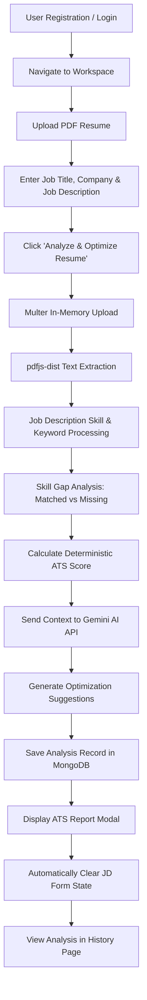

# ResumeATS AI

> A full-stack MERN application that evaluates resumes against job descriptions, calculates a deterministic ATS compatibility score, extracts matched vs. missing skills, and provides AI-powered resume optimization suggestions using Google Gemini.


---

## Table of Contents

- [Project Overview](#project-overview)
- [Problem Statement](#problem-statement)
- [Key Features](#key-features)
- [Application Workflow](#application-workflow)
- [System Architecture](#system-architecture)
- [Technology Stack](#technology-stack)
- [Project Structure](#project-structure)
- [Frontend Architecture](#frontend-architecture)
- [Backend Architecture](#backend-architecture)
- [Authentication Architecture](#authentication-architecture)
- [Resume Processing Workflow](#resume-processing-workflow)
- [ATS Scoring Algorithm](#ats-scoring-algorithm)
- [AI Analysis Engine](#ai-analysis-engine)
- [Database Design](#database-design)
- [API Documentation](#api-documentation)
- [Environment Variables](#environment-variables)
- [Installation & Setup](#installation--setup)
- [Local Development](#local-development)
- [Testing & Manual Verification](#testing--manual-verification)
- [Security & Data Protection](#security--data-protection)
- [Error Handling](#error-handling)
- [UI / UX Features](#ui--ux-features)
- [Screenshots](#screenshots)
- [Deployment Guide](#deployment-guide)
- [Production Checklist](#production-checklist)
- [Future Improvements](#future-improvements)
- [Known Limitations](#known-limitations)
- [Contributing](#contributing)
- [License](#license)

---

## Project Overview

**ResumeATS AI** is an end-to-end recruitment SaaS application built on the MERN stack (MongoDB, Express, React, Node.js). It bridges the gap between job seekers and Applicant Tracking Systems (ATS) by simulating ATS parsing, keyword extraction, and skill-gap scoring. 

The application parses candidate PDF resumes, extracts text content, analyzes target Job Descriptions, calculates a multi-dimensional ATS score, and leverages Google Gemini AI to generate actionable bullet point rewrites, summary improvements, and role-fit assessments.

---

## Problem Statement

Modern recruiting relies heavily on automated Applicant Tracking Systems (ATS) to filter thousands of job applications. Over 75% of qualified resumes are rejected prior to human review due to:

1. **Keyword Mismatches**: Missing critical technical terms or tool names required by the job posting.
2. **Formatting Obstacles**: Non-standard layouts or tables that confuse automated PDF text extractors.
3. **Unfocused Summaries**: Resume summaries that fail to highlight alignment with target job titles.
4. **Lack of Quantifiable Metrics**: Bullet points that list duties instead of measurable achievements.

This project solves these challenges by giving candidates instant, transparent feedback on how their resume aligns with any specific job description before submitting an application.

---

## Key Features

### 🔐 Authentication & Session Security
- User registration with email uniqueness validation.
- Secure login using `bcryptjs` password hashing (salt factor 10).
- State-managed JWT authentication stored in HTTP-only, SameSite cookies.
- Front-end route protection (`ProtectedRoute` component) preventing unauthorized access.

### 📄 Resume Management & Parsing
- PDF resume upload with client-side and server-side validation (5MB max size, PDF format check).
- In-memory PDF text extraction using `pdfjs-dist` (no temp disk files).
- Preserves uploaded resume state for rapid multi-JD evaluations.

### 🎯 Job Description Processing & Skill Extraction
- Analyzes raw Job Description text to identify programming languages, frameworks, databases, cloud tools, soft skills, education credentials, and experience requirements.
- Standardized skill normalization mapping variations (e.g. `JS` → `JavaScript`, `ReactJS` → `React`).

### 📊 Deterministic ATS Scoring Engine
- Multi-dimensional scoring formula weighing 5 key parameters:
  - **Skill Match Score** (35%)
  - **Keyword Match Score** (25%)
  - **Experience Relevance Score** (20%)
  - **Education Match Score** (10%)
  - **Formatting & Structure Score** (10%)
- Categorized visual status badges: `Excellent Match` (≥75%), `Good Match` (50–74%), `Needs Optimization` (<50%).

### 🤖 Gemini AI Optimization Analysis
- Integration with Google Gemini (`gemini-2.5-flash`) for deep qualitative feedback.
- Generates tailored professional summary rewrites.
- Provides actionable bullet-point improvements with reasoning.
- Explains missing skills and recommends how to acquire or list them truthful to candidate background.
- Built-in deterministic fallback generator ensuring system uptime if AI services are unreachable.

### 📜 Analysis History & Reports
- Persists all past resume analyses per user in MongoDB.
- Full-featured ATS report dashboard modal.
- History view displaying saved reports with quick modal preview.
- Custom confirmation modal overlay for deleting saved analysis records.

---

## Application Workflow



---

## System Architecture

```text
┌────────────────────────────────────────────────────────────────────────┐
│                              CLIENT LAYER                              │
│  React 19 SPA (Vite 7) • React Router v7 • Axios HTTP Client          │
│  Design System: Vanilla CSS Tokens (Slate/Blue Light Theme)           │
└───────────────────────────────────┬────────────────────────────────────┘
                                    │ HTTP / HTTPS (REST API)
                                    ▼
┌────────────────────────────────────────────────────────────────────────┐
│                              SERVER LAYER                              │
│  Node.js Runtime • Express.js Server • Cookie-Parser                  │
│                                                                        │
│  ┌───────────────────────┐  ┌──────────────────────────────────────┐  │
│  │   Auth Controller     │  │          Resume Controller           │  │
│  │ Bcrypt / JWT Cookies  │  │  Multer Buffer → pdfjs-dist Parser  │  │
│  └───────────────────────┘  └──────────────────┬───────────────────┘  │
│                                                │                       │
│                             ┌──────────────────┴───────────────────┐   │
│                             │          Utility Modules             │   │
│                             │ • jdProcessor.js                     │   │
│                             │ • skillNormalizer.js                 │   │
│                             │ • atsScore.js (Deterministic Engine) │   │
│                             │ • aiAnalyzer.js (Gemini API / Fallback)│   │
│                             └──────────────────┬───────────────────┘   │
└────────────────────────────────────────────────┼───────────────────────┘
                                                 │
                        ┌────────────────────────┴───────────────────────┐
                        │                                                │
                        ▼                                                ▼
┌──────────────────────────────────────────────┐ ┌──────────────────────────────┐
│                DATABASE LAYER                │ │         EXTERNAL AI          │
│ MongoDB Atlas / Local Database via Mongoose  │ │ Google Gemini API            │
│ Collections: Users, Resumes                  │ │ (gemini-2.5-flash)           │
└──────────────────────────────────────────────┘ └──────────────────────────────┘
```

---

## Technology Stack

| Layer | Technology / Library | Version | Purpose |
| :--- | :--- | :--- | :--- |
| **Frontend UI** | React | `^19.2.0` | Client single-page application framework |
| **Build Tool** | Vite | `^7.3.1` | Next-generation frontend bundler & dev server |
| **Routing** | React Router DOM | `^7.13.0` | Client-side routing (`BrowserRouter`, `Routes`, `Route`) |
| **HTTP Client** | Axios | `^1.13.5` | Asynchronous API communication with cookie credentials |
| **Styling** | Vanilla CSS | CSS3 | Custom CSS variable design tokens (Slate/Blue theme) |
| **Backend Runtime** | Node.js | `18+` | Asynchronous JavaScript server runtime |
| **Web Framework** | Express.js | `^4.18.2` | REST API routing, middleware, and request handling |
| **Database** | MongoDB | `8.0+` | NoSQL document-oriented database persistence |
| **ODM** | Mongoose | `^8.0.0` | Schema-based MongoDB object modeling |
| **Authentication** | JSON Web Token (`jsonwebtoken`) | `^9.0.2` | Stateless user authentication & session token signing |
| **Password Security**| `bcryptjs` | `^2.4.3` | Salted password hashing algorithm |
| **File Handling** | Multer | `^1.4.5-lts.1` | In-memory multipart form-data resume upload middleware |
| **PDF Parsing** | `pdfjs-dist` | `^5.4.624` | Structured text stream extraction from PDF buffers |
| **Generative AI** | `@google/generative-ai` / Fetch | `^0.24.1` | Google Gemini 2.5 Flash API for resume analysis |

---

## Project Structure

```text
ResumeATS-AI/
├── client/                           # React 19 Frontend Application
│   ├── src/
│   │   ├── components/
│   │   │   ├── AnalysisHistory/      # Saved Analysis History Page & Card Grid
│   │   │   │   ├── index.jsx
│   │   │   │   └── index.css
│   │   │   ├── Contact/              # Support & Feedback Contact Page
│   │   │   │   ├── index.jsx
│   │   │   │   └── index.css
│   │   │   ├── Home/                 # Product Landing Page
│   │   │   │   ├── index.jsx
│   │   │   │   └── index.css
│   │   │   ├── Login/                # User Authentication Login Form
│   │   │   │   ├── index.jsx
│   │   │   │   └── index.css
│   │   │   ├── Navbar/               # Header Navigation & Mobile Drawer
│   │   │   │   ├── index.jsx
│   │   │   │   └── index.css
│   │   │   ├── ProtectedRoute/       # Auth Guard Component
│   │   │   │   └── index.jsx
│   │   │   ├── Register/             # User Registration Form
│   │   │   │   ├── index.jsx
│   │   │   │   └── index.css
│   │   │   └── YourResumes/          # Workspace & Analysis Dashboard
│   │   │       ├── index.jsx         # Workspace Upload & Form State Management
│   │   │       ├── ReportModal.jsx   # ATS Compatibility Report Dashboard Modal
│   │   │       └── index.css
│   │   ├── services/
│   │   │   ├── api.js                # Axios Instance with Base URL & Error Interceptors
│   │   │   ├── authService.js        # Auth API endpoints (login, register, logout, me)
│   │   │   ├── contactService.js     # Contact Form API endpoint
│   │   │   └── resumeService.js      # Resume Upload, Analyze, History & Delete APIs
│   │   ├── App.css                   # Global Layout Rules
│   │   ├── App.jsx                   # Application Routes Definition
│   │   ├── index.css                 # Global CSS Custom Properties & Design Tokens
│   │   └── main.jsx                  # React DOM Root Entrypoint
│   ├── .env                          # Frontend Environment Configuration
│   ├── index.html                    # Single Page HTML Template
│   ├── package.json                  # Frontend Dependencies & Scripts
│   └── vite.config.js                # Vite Server Configuration & API Proxy Rules
│
├── server/                           # Node.js + Express REST API Backend
│   ├── controllers/
│   │   ├── authController.js         # Register, Login, Logout, Profile Handlers
│   │   ├── contactController.js      # Contact Form Handler
│   │   └── resumeController.js      # Upload, Analyze, History, Delete Handlers
│   ├── middleware/
│   │   ├── authMiddleware.js         # JWT Verification Middleware
│   │   └── upload.js                 # Multer Memory Storage Configuration
│   ├── models/
│   │   ├── Resume.js                 # Resume Analysis Schema Definition
│   │   └── User.js                   # User Schema with Bcrypt Hooks
│   ├── routes/
│   │   ├── authRoutes.js             # Auth Route Definitions (/auth/*)
│   │   ├── contactRoutes.js          # Contact Route Definition (/contact)
│   │   └── resumeRoutes.js           # Resume Route Definitions (/resume/*)
│   ├── utils/
│   │   ├── aiAnalyzer.js             # Gemini AI Prompt Construction & Fallback Engine
│   │   ├── atsScore.js               # Weighted Deterministic ATS Scoring Math
│   │   ├── jdProcessor.js            # Job Description Metadata & Keyword Extractor
│   │   ├── pdfGenerator.js           # PDF Output Utility Stub
│   │   ├── resumeParser.js           # pdfjs-dist Buffer Text Stream Parser
│   │   └── skillNormalizer.js        # Technical Skill Dictionary & Normalization
│   ├── .env                          # Server Environment Variables (PORT, MONGO_URI, etc.)
│   ├── package.json                  # Server Dependencies & Scripts
│   └── server.js                     # Express App Initialization & Database Connection
│
└── README.md                         # Global Comprehensive Documentation
```

---

## Frontend Architecture

The frontend is structured as a component-driven React single-page application:

- **State Management**: React `useState` and `useEffect` manage workspace state, form state, step indices, modal open/close states, and user history arrays.
- **Routing**: `App.jsx` handles client-side routing. Navigation to `/analyzer`, `/your-resumes`, and `/analysis-history` is protected by `ProtectedRoute.jsx`.
- **API Interceptor**: `services/api.js` creates a centralized Axios instance configured with `withCredentials: true` and fallback baseURL (`http://localhost:5000`).
- **Design System**: All components consume CSS custom properties defined in `client/src/index.css` (Slate `#0F172A`, Page `#F8FAFC`, Surface `#FFFFFF`, Primary `#2563EB`).

---

## Backend Architecture

The backend implements a decoupled REST API architecture following MVC principles:

```text
HTTP Request
     ↓
server.js (Express Middleware: Cors, Json, CookieParser)
     ↓
Routes Layer (authRoutes.js, resumeRoutes.js, contactRoutes.js)
     ↓
Auth Middleware (JWT validation via cookie or authorization header)
     ↓
Controllers Layer (authController.js, resumeController.js)
     ↓
Utils & Processing Services (resumeParser, jdProcessor, atsScore, aiAnalyzer)
     ↓
Models Layer (Mongoose User and Resume Schemas)
     ↓
MongoDB Persistence Layer
```

---

## Authentication Architecture

1. **User Registration**:
   - Accepts `name`, `email`, and `password`.
   - Validates email uniqueness.
   - `User.js` pre-save hook automatically salts and hashes passwords using `bcrypt.hash(password, 10)`.
   - Generates a signed JWT token (`jwt.sign({ id: user._id }, JWT_SECRET)`).
   - Sets an `httpOnly`, `SameSite: lax` cookie named `token` (7-day expiration).

2. **User Login**:
   - Queries database selecting the hidden `+password` field.
   - Validates credentials using `user.comparePassword(password)`.
   - Issues a fresh HTTP-only `token` cookie.

3. **Protected API Requests**:
   - `authMiddleware.js` extracts token from HTTP cookies (`req.cookies.token`) or Authorization header (`Bearer <token>`).
   - Verifies signature using `jwt.verify(token, JWT_SECRET)`.
   - Attaches `req.user` decoded payload to the request object.

---

## Resume Processing Workflow

1. **Upload Handling**:
   - Endpoint `/resume/analyze` receives `multipart/form-data` with `req.file` (resume PDF) and text fields (`jobDescription`, `jobTitle`, `companyName`).
   - Enforces a 5MB maximum file size limit.
2. **Buffer Conversion**:
   - Converts Node.js buffer into a `Uint8Array` slice (`new Uint8Array(buffer.buffer, buffer.byteOffset, buffer.byteLength)`).
3. **Text Stream Extraction**:
   - `parseResume(uint8Array)` loads the document using `pdfjs-dist/legacy/build/pdf.mjs`.
   - Iterates page by page extracting text item strings into a unified readable string.
4. **Validation**:
   - Rejects empty or unreadable non-text PDF files with HTTP status 400.

---

## ATS Scoring Algorithm

The system uses a **deterministic, reproducible scoring algorithm** (`utils/atsScore.js`):

$$\text{Overall ATS Score} = \text{round}(0.35 \times S + 0.25 \times K + 0.20 \times X + 0.10 \times E + 0.10 \times F)$$

Where:
- $S$ (**Skill Match Score**): Percentage of required skills found in the resume ($|\text{Matched Skills}| / |\text{Total JD Skills}| \times 100$).
- $K$ (**Keyword Match Score**): Percentage of unique Job Description keywords present in the resume text.
- $X$ (**Experience Score**): Frequency of action verbs (`developed`, `built`, `managed`, `optimized`, `spearheaded`).
- $E$ (**Education Score**): Verification of academic credentials (`bachelor`, `master`, `computer science`, `degree`).
- $F$ (**Formatting Score**): Detection of standard resume section headers (`Experience`, `Education`, `Skills`, `Projects`, `Summary`).

---

## AI Analysis Engine

1. **Primary AI Engine (`analyzeWithGemini`)**:
   - Connects to Google Gemini API using `gemini-2.5-flash`.
   - Constructs a prompt incorporating extracted resume text, job description, matched skills, and missing skills.
   - Enforces a strict JSON output schema.
   - Includes explicit system instructions prohibiting skill fabrication or false experience claims.
2. **Fallback Analysis Engine (`getFallbackAnalysis`)**:
   - If `GEMINI_API_KEY` is omitted or API rate limits/outages occur, the application seamlessly returns a pre-structured analysis based on extracted skill gaps, ensuring zero downtime.

---

## Database Design

### User Model (`server/models/User.js`)
```javascript
{
  name: { type: String, required: true, trim: true },
  email: { type: String, required: true, unique: true, lowercase: true, trim: true },
  password: { type: String, required: true, select: false },
  timestamps: true // createdAt, updatedAt
}
```

### Resume Model (`server/models/Resume.js`)
```javascript
{
  userId: { type: Schema.Types.ObjectId, ref: "User", required: true },
  filename: { type: String, default: "resume.pdf" },
  fileSize: { type: Number, default: 0 },
  jobTitle: { type: String, default: "" },
  companyName: { type: String, default: "" },
  jobDescription: { type: String, required: true },
  resumeText: { type: String, required: true },
  atsScore: { type: Number, required: true, default: 0 },
  scoreBreakdown: {
    overallScore: Number,
    keywordScore: Number,
    skillScore: Number,
    experienceScore: Number,
    educationScore: Number,
    formattingScore: Number
  },
  matchedSkills: [String],
  missingSkills: [String],
  partialMatches: [String],
  aiSuggestions: Object,
  timestamps: true // createdAt, updatedAt
}
```

---

## API Documentation

### Authentication Routes (`/auth`)

| Method | Endpoint | Auth Required | Description | Request Body |
| :--- | :--- | :--- | :--- | :--- |
| `POST` | `/auth/register` | No | Register a new user | `{ name, email, password }` |
| `POST` | `/auth/login` | No | Authenticate user & issue cookie | `{ email, password }` |
| `POST` | `/auth/logout` | No | Clear authentication cookie | `{}` |
| `GET` | `/auth/me` | Yes | Get authenticated user profile | None |

### Resume Routes (`/resume`)

| Method | Endpoint | Auth Required | Description | Request Payload |
| :--- | :--- | :--- | :--- | :--- |
| `POST` | `/resume/upload` | Yes | Upload standalone PDF & extract text | `multipart/form-data` (`resume` file) |
| `POST` | `/resume/analyze` | Yes | Run ATS & AI analysis on Resume + JD | `multipart` or `JSON` (`resume`, `jobDescription`, `jobTitle`, `companyName`) |
| `GET` | `/resume/history` | Yes | Fetch user's saved analysis records | None |
| `DELETE`| `/resume/:id` | Yes | Delete a saved analysis record by ID | None |

### Contact Routes (`/contact`)

| Method | Endpoint | Auth Required | Description | Request Body |
| :--- | :--- | :--- | :--- | :--- |
| `POST` | `/contact` | No | Submit support/feedback message | `{ name, email, message }` |

---

## Environment Variables

### Server (`server/.env`)
```env
PORT=5000
MONGO_URI=mongodb://localhost:27017/ats_analyzer
JWT_SECRET=your_super_secret_jwt_key_here
GEMINI_API_KEY=your_google_gemini_api_key_here
CLIENT_URL=http://localhost:5173
CONTACT_EMAIL=support@resumeatsai.com
NODE_ENV=development
```

### Client (`client/.env`)
```env
VITE_API_BASE_URL=http://localhost:5000
```

---

## Installation & Setup

### Prerequisites
- **Node.js**: v18.0.0 or higher
- **npm**: v9.0.0 or higher
- **MongoDB**: Local MongoDB instance running on port 27017 or MongoDB Atlas connection URI.

### 1. Clone Repository
```bash
git clone https://github.com/Prasanna-Anjaneyulu078/AI-ATS-Resume-Analyzer.git
cd AI-ATS-Resume-Analyzer
```

### 2. Server Setup
```bash
cd server
npm install
# Create server/.env file using template above
npm start
```

### 3. Client Setup
```bash
cd ../client
npm install
# Create client/.env file using template above
npm run dev
```

---

## Local Development

- **Frontend Application**: `http://localhost:5173`
- **Backend Express Server**: `http://localhost:5000`
- **Vite Proxy Config**: Requests to `/auth`, `/resume`, `/contact` on port 5173 are automatically proxied to port 5000 in development.

---

## Testing & Manual Verification

Automated unit test coverage is currently limited. Manual verification checklist:

- [x] **Registration**: Register new account, verify password hashing in database, verify HTTP-only cookie set.
- [x] **Login**: Login with valid credentials, verify redirect to workspace.
- [x] **Protected Routes**: Attempt accessing `/your-resumes` unauthenticated; verify redirect to `/login`.
- [x] **Resume Upload**: Upload valid PDF (<5MB), verify text extraction.
- [x] **JD Analysis**: Enter target role, company, and JD; verify score calculation and Gemini suggestions.
- [x] **Form Reset**: Verify JD fields automatically reset after successful analysis while preserving report.
- [x] **Analysis History**: Verify saved analyses populate in history tab.
- [x] **Delete Confirmation**: Click delete on history card, verify custom confirmation modal pops up.
- [x] **Responsive Layout**: Verify UI across desktop (1440px), tablet (768px), and mobile (375px).

---

## Security & Data Protection

- **Password Hashing**: `bcryptjs` salted hashing before persisting to MongoDB.
- **Stateless Tokens**: JWT with 7-day expiration.
- **HTTP-Only Cookies**: Prevents client-side XSS access to auth token.
- **Memory File Storage**: PDF files processed in RAM buffers; zero disk storage of uploaded user files.
- **Input Sanitization**: Mongoose schema sanitization and regex validation on email addresses.
- **User Ownership Guard**: All resume queries enforced with `{ userId: req.user.id }`.

---

## Error Handling

- **Invalid File Type**: HTTP 400 error if non-PDF files are selected.
- **File Size Limit**: HTTP 413 Payload Too Large error for files exceeding 5MB.
- **AI Service Resilience**: Fallback engine responds gracefully if `GEMINI_API_KEY` is missing or API errors occur.
- **API Error Interceptor**: Centralized Axios interceptor in `client/src/services/api.js` surfacing friendly error messages.

---

## UI / UX Features

- **SaaS Color System**: Clean Slate & Production Blue design system (`#F8FAFC`, `#FFFFFF`, `#2563EB`, `#0F172A`).
- **Responsive Navigation**: Desktop top bar & mobile slide-in side menu drawer.
- **ATS Summary Card**: Structured top card hierarchy showing score percentage, match status pill, target role, company, and resume filename.
- **Skill Badges**: Color-coded matched (`#F0FDF4`), missing (`#FFFBEB`), and partial match (`#F0F9FF`) chips.
- **Before vs After Rewrites**: Side-by-side comparison cards for bullet point optimizations.

---

## Screenshots

*(Screenshots will be added here)*

---

## Deployment Guide

### Backend Deployment (e.g. Render / Railway)
1. Set root directory to `server`.
2. Set Build Command: `npm install`.
3. Set Start Command: `node server.js`.
4. Configure environment variables (`MONGO_URI`, `JWT_SECRET`, `GEMINI_API_KEY`, `CLIENT_URL`).

### Frontend Deployment (e.g. Vercel / Netlify)
1. Set root directory to `client`.
2. Set Build Command: `npm run build`.
3. Set Output Directory: `dist`.
4. Configure environment variable `VITE_API_BASE_URL` pointing to live backend URL.

---

## Production Checklist

- [ ] Configure HTTPS for frontend and backend domains.
- [ ] Set `NODE_ENV=production` in server environment.
- [ ] Enable `SameSite=none` and `secure=true` on auth cookies for cross-domain production deployments.
- [ ] Restrict `CORS` `allowedOrigins` to production domain.
- [ ] Provision MongoDB Atlas cluster with restricted IP access.
- [ ] Set production `JWT_SECRET` key.

---

## Future Improvements

- [ ] Multi-format resume support (.docx, .txt).
- [ ] PDF report download feature.
- [ ] Side-by-side resume version comparison tool.
- [ ] Dark / Light mode toggle.
- [ ] Advanced role-specific ATS keywords dictionary.

---

## Known Limitations

- **File Format**: Parsing currently optimized for standard text-selectable PDF documents. Scanned image-only PDFs require OCR integration.
- **AI Token Limits**: Job descriptions over 25,000 characters are truncated before AI prompt submission.

---

## Contributing

1. Fork the repository.
2. Create a new feature branch (`git checkout -b feature/AmazingFeature`).
3. Commit your changes (`git commit -m 'Add some AmazingFeature'`).
4. Push to the branch (`git push origin feature/AmazingFeature`).
5. Open a Pull Request.

---

## License

No license has currently been specified for this project.

---

## Author / Repository Links

- **Repository**: [https://github.com/Prasanna-Anjaneyulu078/AI-ATS-Resume-Analyzer](https://github.com/Prasanna-Anjaneyulu078/AI-ATS-Resume-Analyzer)
- **Maintainer**: Prasanna Anjaneyulu
